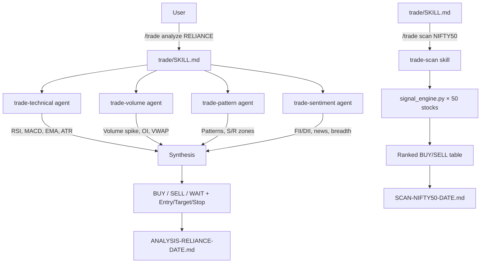

#  AI Trade Analyst

> Intraday stock analysis powered by Claude Code. Four specialist AI agents run in parallel to deliver a single, actionable trade signal with entry, targets, and stop loss.

A PIT Solutions internal tool for intraday equity analysis on NSE/BSE stocks.

---

## What It Does

Type `/trade analyze RELIANCE` in Claude Code and four AI agents immediately start working in parallel:

| Agent | Job |
|-------|-----|
| **trade-technical** | RSI, MACD, EMA (9/21/50), Bollinger Bands, VWAP, ATR |
| **trade-volume** | Volume spikes, delivery %, OI buildup, Put/Call ratio |
| **trade-pattern** | Candlestick patterns, support/resistance zones |
| **trade-sentiment** | Market breadth, FII/DII, sector rotation, news |

All four complete and the system synthesizes one clear output:

```
SYMBOL: RELIANCE.NS
Signal:  🟢 BUY
Entry:   ₹2,450 – ₹2,460
Target:  ₹2,510 (T1)  →  ₹2,550 (T2)
Stop:    ₹2,420
R:R:     1:2.0
Confidence: HIGH
Reason:  RSI 62, MACD bullish cross, 2.3× volume spike, broke ₹2,440 resistance
```

No signal is generated unless Risk:Reward ≥ 1:1.5.

---

## Commands

| Command | What it does | Output |
|---------|-------------|--------|
| `/trade analyze <SYMBOL>` | Full analysis — 4 agents in parallel | `ANALYSIS-[SYMBOL]-[DATE].md` |
| `/trade quick <SYMBOL>` | 60-second snapshot, terminal only | Terminal print |
| `/trade scan NIFTY50` | Scan all 50 stocks, find live setups | `SCAN-NIFTY50-[DATE].md` |
| `/trade scan BANKNIFTY` | Scan BANKNIFTY 12 constituents | `SCAN-BANKNIFTY-[DATE].md` |
| `/trade scan watchlist` | Scan only your saved stocks | `SCAN-watchlist-[DATE].md` |
| `/trade watchlist add TCS` | Add stock to watchlist | `WATCHLIST.md` |
| `/trade watchlist show` | Print current watchlist | Terminal print |
| `/trade report` | End-of-day summary of all signals | `REPORT-[DATE].md` |

**Valid index names for scan:** `NIFTY50`, `BANKNIFTY`, `NIFTY100`, `MIDCAP`, `watchlist`

---

## Project Structure

```
ai-trade-claude/
│
├── trade/
│   └── SKILL.md              ← Main orchestrator — routes all /trade commands
│
├── skills/
│   ├── trade-analyze/        ← Full 4-agent analysis + synthesis
│   ├── trade-quick/          ← Fast inline snapshot
│   ├── trade-scan/           ← Multi-stock scanner
│   ├── trade-watchlist/      ← Watchlist CRUD
│   └── trade-report/         ← End-of-day report
│
├── agents/
│   ├── trade-technical.md    ← RSI, MACD, EMA, Bollinger, VWAP, ATR
│   ├── trade-volume.md       ← Volume spikes, OI, delivery %, VWAP behaviour
│   ├── trade-pattern.md      ← Candlestick patterns, S/R zones
│   └── trade-sentiment.md    ← FII/DII, breadth, news, sector
│
├── scripts/
│   ├── data_fetcher.py       ← Fetch OHLCV data via yfinance
│   ├── indicators.py         ← Compute RSI, MACD, EMA, Bollinger, VWAP, ATR
│   ├── signal_engine.py      ← Score indicators → BUY / SELL / WAIT signal
│   └── pattern_scanner.py    ← Detect candlestick patterns
│
├── requirements.txt
├── install.sh                ← Mac/Linux installer
└── install.ps1               ← Windows PowerShell installer
```

---

## How to Run This Project

### Prerequisites

**1. Claude Code**

Windows (PowerShell):
```powershell
irm https://claude.ai/install.ps1 | iex
```

Mac/Linux:
```bash
npm install -g @anthropic-ai/claude-code
```

You need an Anthropic API key — get one at [console.anthropic.com](https://console.anthropic.com).

---

**2. Python 3.8+**

Check if installed:
```powershell
python --version
```

If not installed, download from [python.org/downloads](https://www.python.org/downloads/).
On Windows, tick **"Add Python to PATH"** during installation.

---

**3. Install Python dependencies**
```powershell
cd d:\AI\ai-trade-claude
pip install -r requirements.txt
```

This installs: `yfinance`, `pandas`, `numpy`, `requests`

---

### Install Skills Into Claude Code

**Windows (PowerShell):**
```powershell
cd d:\AI\ai-trade-claude
.\install.ps1
```

**Mac/Linux:**
```bash
cd /path/to/ai-trade-claude
chmod +x install.sh
./install.sh
```

---

### Run Claude Code

```powershell
cd d:\AI\ai-trade-claude
claude
```

Then type your first command:
```
/trade analyze RELIANCE
```

---

## Example Workflows

### Workflow 1 — Morning Scan
```
/trade scan NIFTY50
```
Claude scans all 50 NIFTY stocks on the 15-min chart, ranks setups by signal score, and saves a report. Takes 3–5 minutes.

Then pick a stock from the results:
```
/trade analyze HDFCBANK
```

---

### Workflow 2 — Quick Check Before Entry
```
/trade quick TATAMOTORS
```
Get a 60-second read on RSI, MACD, VWAP position. No files written. Best used when you already have a stock in mind.

---

### Workflow 3 — Watchlist Monitoring
```
/trade watchlist add RELIANCE
/trade watchlist add INFY
/trade watchlist add BAJFINANCE
/trade scan watchlist
```

---

### Workflow 4 — End of Day Review
```
/trade report
```
Summarizes all signals given today, checks which hit target vs which hit stop, shows win rate.

---

## Signal Logic

Every BUY or SELL signal must clear these gates before being published:

| Gate | Condition |
|------|-----------|
| Momentum | RSI 45–70 (BUY) or 30–55 (SELL) |
| Trend | MACD crossover in last 5 candles |
| Institutional bias | Price above (BUY) or below (SELL) VWAP |
| Conviction | Volume ≥ 1.3× 20-candle average |
| Risk | R:R ratio ≥ 1.5 |

If any gate fails → output is 🟡 WAIT, not a signal.

---

## Data Source

All data is fetched free of charge using `yfinance`:
- No account required
- NSE stocks: use `.NS` suffix (e.g., `RELIANCE.NS`)
- BSE stocks: use `.BO` suffix
- Indices: `^NSEI` (NIFTY 50), `^NSEBANK` (BANKNIFTY)

For live market depth and OI, optional Zerodha Kite API integration is supported — set `KITE_API_KEY` environment variable.

---

## Architecture



---

## Disclaimer

This tool is for **informational and educational purposes only**.

